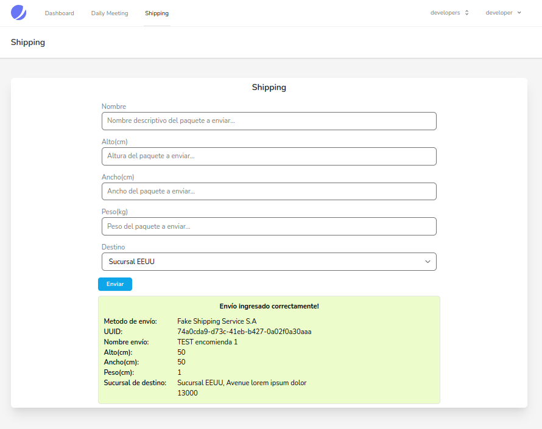

# Evaluación de conocimientos PHP/Laravel

La evaluación consta en que el postulante realice las tareas solicitadas en los casos de usos descritos a continuación. Se trabajará sobre un proyecto base, en el cual se busca encontrar que además de la funcionalidad, el participante muestre un código que cumpla con buenas prácticas de POO, con la finalidad de lograr un código limpio y fácil de mantener/escalar.  
  
El ejercicio ha de realizarse en un repositorio público de github.

## Credenciales de suarios

**Usuario del grupo admins:**  
user: teachlead@test.com  
password: password  

**Usuarios del grupo developers:**  
user: developer@test.com  
password: password  
  
user: developer2@test.com  
password: password  
  
## Configuraciones de ambiente    

**Pusher:**  
PUSHER_APP_ID=1272264  
PUSHER_APP_KEY=4d16828715a88164a4b4  
PUSHER_APP_SECRET=574783a86ae30d6fc98d  
PUSHER_APP_CLUSTER=us2  
  
El nombre del canal que utiliza el proyecto es **chat-channel** y escucha el evento **chat-event**.  
  
**Ejecutar las migraciones en cuanto levante el ambiente:**    
php artisan migrate:fresh --seed

## Requerimientos:
  
1. Solo los usuarios pertenecientes al grupo admins tendrán acceso a la ruta **“teams/create”** y podrán usar el CRUD asociado al modelo Team.

2. Configurar el proyecto para que utilice pusher con las configuraciones indicadas anteriormente e implementar un chat grupal para que los usuarios puedan interactuar en la  ruta **“/dashboard”**. En esta ruta se encuentra en uso el componente livewire TeamChat.

3. Los usuarios del equipo podrán ingresar mensajes con la información correspondiente a la reunión diaria, que busca mantener al equipo en conocimiento del progreso de los proyectos en los cuales están participando. Para esto es necesario crear una nueva tabla en la BD con el nombre **daily_meetings** y las columnas **id(PK auto increment), user_id(FK users), done(nullable), doing(nullable), blocking(nullable), todo(nullable), created_at, updated_at**.

4. Se debe implementar una lógica que procese los mensajes ingresados en el chat, con el fin de identificar mensajes que a modo de comandos utilizaremos para ingresar data a la tabla creada en el paso 3. La información respecto a la reunión diaria deberá ser guardada en BD cada vez que un usuario ingrese un comentario en el chat que cumpla con las siguientes reglas, tomando como ejemplo el mensaje:
  
    **@daily** **done:** done test message **#** **doing:** doing test message **#** **blocking:** blocking test message **#** **todo:** todo test message
    
**@daily:** Cuando un mensaje contiene este string, se debe buscar la data de los diferentes ítems.  
**#:** Es el separador que indica el fin de cada ítem.   
**(done:, doing:, blocking:, todo: ):** Luego de @daily se pueden ingresar estos ítems seguidos del texto a ingresar y el separador para indicar el fin del mismo.  

5. Habilitar la ruta **“/dailyMeeting”** para que liste la información de las reuniones diarias que ya tenemos almacenadas. Solo se deben mostrar los registros correspondientes al día en curso y solo uno por usuario, este último ha de ser el más reciente en los registros.

6. En un escenario hipotético presentado en la ruta **“/shippings/create”**. Los usuarios tienen acceso a un formulario en el cual registran envíos de encomiendas con destino a una sucursal en EEUU, el sistema se comunica con un servicio externo ficticio que llamaremos “Fake Shipping Service S.A” el cual se encarga de procesar los datos que enviamos y luego nos devuelve un array con la información del nuevo registro.
  

En este contexto es necesario que se implemente un nuevo comportamiento cuando los usuarios seleccionen como destino la sucursal en Chile que fue recientemente agregada, para este caso utilizaremos un servicio interno de mensajeria por lo que necesitaremos almacenar los datos del formulario en la tabla **“shippings”** de nuestra BD además del user_id y generar un UUID para el seguimiento del envío.    
Se debe validar: 

- **Nombre:** obligatorio.
- **Alto:** obligatorio, numérico, mínimo 1, máximo 2 metros, mostrar el mismo mensaje de obligatoriedad en caso de error por no cumplir el minimo, al violar el maximo el mensaje de error es 'El campo Alto no debe ser mayor a 2 mt.'.
- **Ancho:** obligatorio, numérico, mínimo 1, máximo 2 metros, mostrar el mismo mensaje de obligatoriedad en caso de error por no cumplir el minimo, al violar el maximo el mensaje de error es 'El campo Alto no debe ser mayor a 2 mt.'.
- **Peso:** obligatorio, numérico, mínimo 1, máximo 10 kg, mostrar el mismo mensaje de obligatoriedad en caso de error por no cumplir el minimo, al violar el maximo el mensaje de error es 'El campo Peso no debe ser mayor a 10 kg.'.
- **Destino:** obligatorio, solo puede ser 1 o 2. El valor 1 representa a la sucursal de EEUU y el 2 la de Chile.
- Mostrar la validación de los campos en español, por lo tanto es necesario traducir el nombre de los atributos mostrados por defecto.

Ejemplo de un mensaje exitoso en el caso de un envio a la sucursal en Chile:
 
